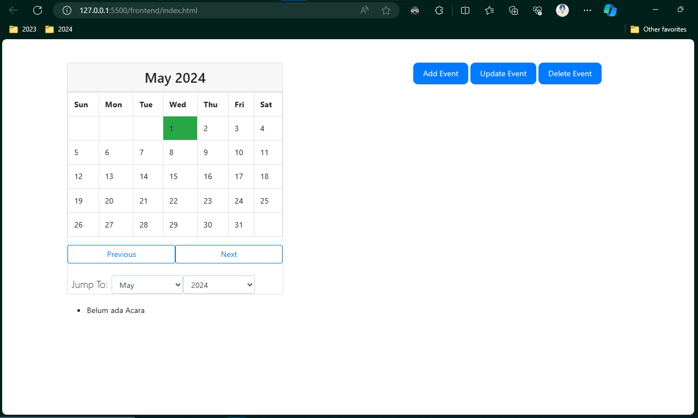
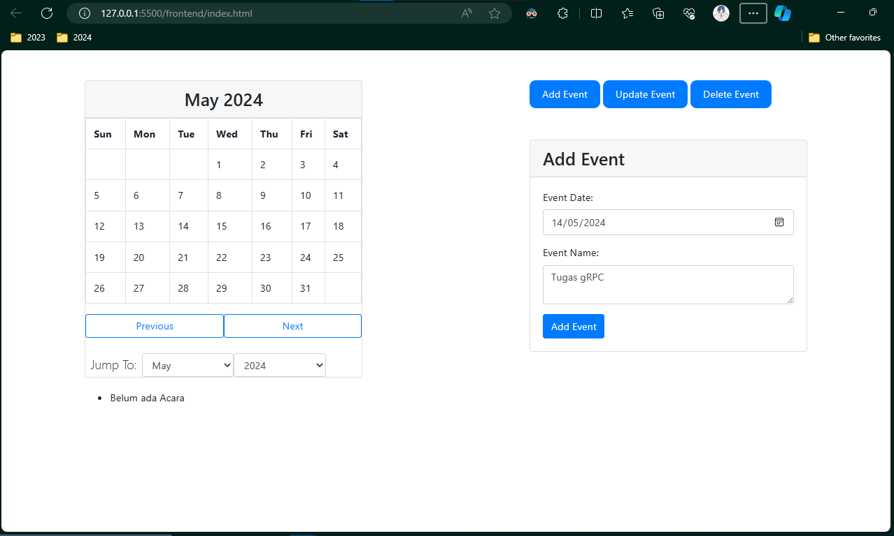
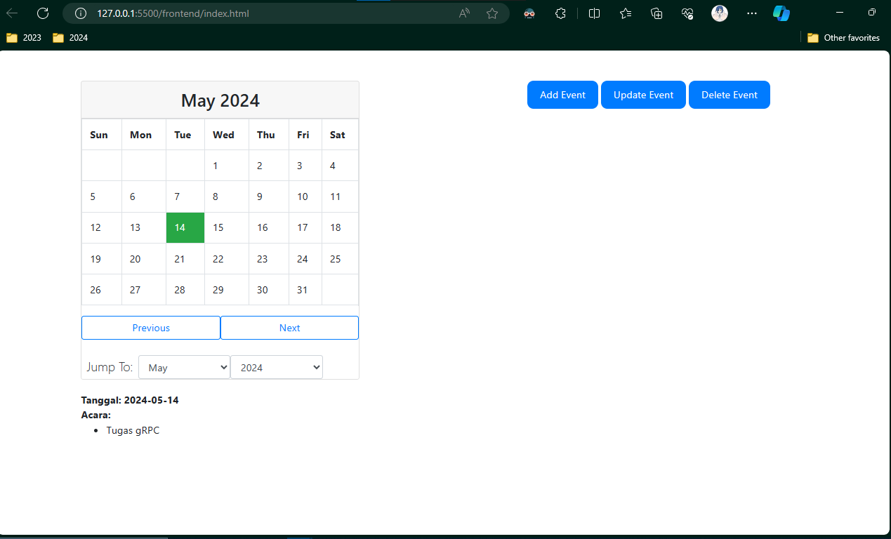
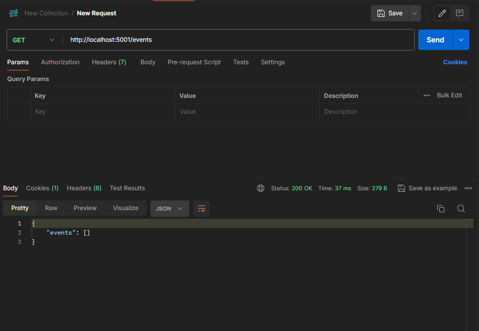
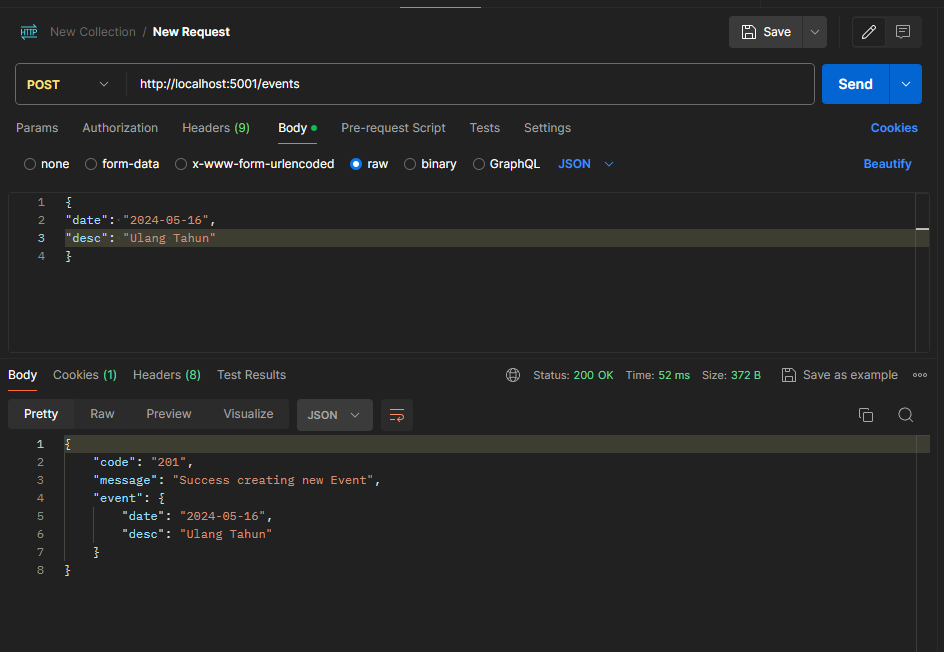
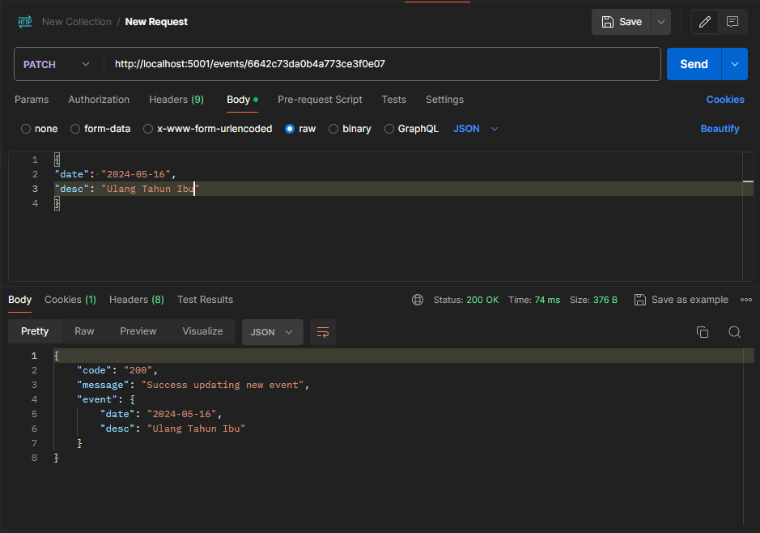
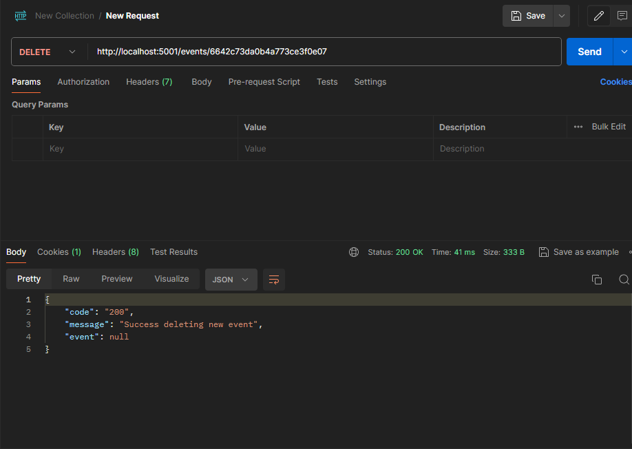

# Event Tracker Calendar
## Sighra Attariq Sumere Jati - 5027221068

A simple event tracker calendar app created using `HTML` and `grpc` using `MongoDB` for the database to help you organize your daily tasks!

## How to run?

#### Prerequisites

- Python 3.11 

- Postman API

- MongoDB

#### Server
1. `cd backend`

2. `yarn server`

#### Client
1. `cd backend`

2. `yarn client`

3. Akses di web browser `localhost:5001`

## Dokumentasi Website

Home page untuk menambah, mengupdate, dan juga menghapus **event**

Bentuk webpage setelah dilakukan penambahan **event**

## Dokumentasi API

**GET**

**POST**

**PATCH**

**DELETE**

## Demo Video

Video demo dapat diakses [disini](https://youtu.be/bbNlGoorLws)